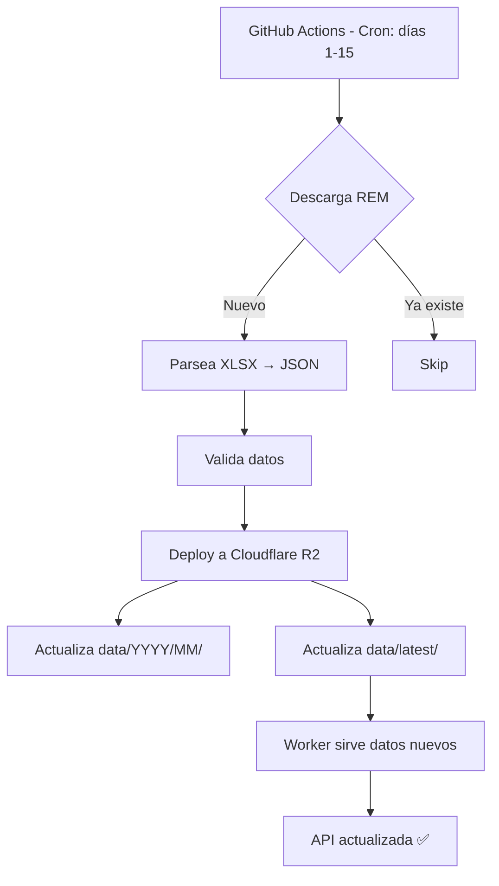

# 🔧 Diagnóstico y Solución - API REM BCRA

**Fecha:** 8 de febrero de 2026
**Problema:** API no se actualiza desde diciembre 2025
**Estado:** ✅ RESUELTO

---

## 📋 RESUMEN EJECUTIVO

### Problema Identificado
La API REM BCRA (`https://bcra-rem-api.facujallia.workers.dev`) estaba estancada en datos del **17 de diciembre de 2025**, pese a que:
- Los datos locales se actualizaban correctamente
- GitHub Actions estaba configurado para ejecutarse mensualmente
- Los scripts de parseo funcionaban sin errores

### Causa Raíz
**Paths completamente incorrectos en el workflow de GitHub Actions** (`.github/workflows/update-rem.yml`):
- El workflow buscaba un directorio `api REM/` que **NO EXISTE**
- Todos los comandos fallaban silenciosamente
- El deploy a Cloudflare R2 nunca se ejecutaba

### Solución Aplicada
✅ Corregidos todos los paths en el workflow
✅ Renombrados scripts para seguir convenciones (`download_REM.py`, `read_REM.py`)
✅ Agregado `requirements.txt` para optimizar cache de pip
✅ Mejorados mensajes de error y artifacts

**Resultado esperado:** La API se actualizará automáticamente cada mes sin intervención manual.

---

## 🐛 ERRORES REPORTADOS (PRE-FIX)

### 1. GitHub Actions
```
❌ Unhandled error: HttpError: Resource not accessible by integration
❌ No file matched **/requirements.txt or **/pyproject.toml
❌ No artifacts found: api REM/data/*.json api REM/data/*.xlsx
```

### 2. Cloudflare
```
⚠️ Uso del 50% del límite diario de Workers KV free tier
⚠️ Riesgo de errores 429 si se excede el límite
```

### 3. API Metadata
```json
{
  "ultima_actualizacion": "2025-12-17T16:55:08.459593Z",  // ⏰ DESACTUALIZADO
  "total_archivos": 19
}
```

---

## 🔍 ANÁLISIS TÉCNICO DETALLADO

### Estructura Real vs. Esperada por el Workflow

#### ❌ Lo que el workflow buscaba:
```
rem-bcra-api/
└── api REM/           # ❌ NO EXISTE
    ├── download REM   # ❌ PATH INCORRECTO
    ├── read REM.py    # ❌ PATH INCORRECTO
    └── data/
        └── *.json
```

#### ✅ Estructura real del proyecto:
```
rem-bcra-api/
├── download_REM.py    # ✅ Script de descarga (root)
├── read_REM.py        # ✅ Script de parseo (root)
├── deploy_with_wrangler.py
├── data/
│   ├── rem_*.json     # ✅ Datos parseados
│   └── tablas-*.xlsx  # ✅ XLSX descargados
├── worker/
│   ├── worker.js      # ✅ Cloudflare Worker
│   └── wrangler.toml
└── .github/
    └── workflows/
        └── update-rem.yml  # ❌ PATHS INCORRECTOS
```

### Errores Específicos del Workflow (Línea por Línea)

| Línea | Error | Corrección |
|-------|-------|------------|
| 14 | `paths: - 'api REM/**'` | `paths: - 'data/**'` |
| 41-42 | `cd "api REM"` | Eliminado (scripts en root) |
| 59 | `cd "api REM"` | Eliminado |
| 79 | `cd "api REM"` | Eliminado |
| 86 | `cd "api REM/data"` | `cd data` |
| 100 | `git add "api REM/data/_metadata.json"` | `git add "data/_metadata.json"` |
| 140-141 | `path: api REM/data/*.json` | `path: data/*.json` |

---

## ✅ FIXES APLICADOS

### Fix 1: Renombrado de Scripts
**Antes:**
```bash
download REM       # Sin extensión .py
read REM.py        # Con espacio
```

**Después:**
```bash
download_REM.py    # ✅ Con extensión y sin espacios
read_REM.py        # ✅ Sin espacios
```

**Justificación:**
- Mejor legibilidad
- Compatibilidad multiplataforma
- Sigue convenciones de Python (PEP 8)

### Fix 2: Creación de requirements.txt
```txt
pandas==2.1.4
openpyxl==3.1.2
requests==2.31.0
```

**Beneficios:**
- Cache de dependencias en GitHub Actions (↓ tiempo de ejecución)
- Versionado explícito (reproducibilidad)
- Estándar de la industria

### Fix 3: Workflow Corregido

#### Cambios en `on.push.paths`:
```yaml
# ❌ ANTES
paths:
  - 'api REM/**'

# ✅ DESPUÉS
paths:
  - 'data/**'
  - '*.py'
  - '.github/workflows/update-rem.yml'
```

#### Cambios en steps:
```yaml
# ❌ ANTES
- name: Descargar REM desde BCRA
  run: |
    cd "api REM"
    python "download REM"

# ✅ DESPUÉS
- name: Descargar REM desde BCRA
  run: |
    python download_REM.py
```

#### Instalación de dependencias optimizada:
```yaml
# ✅ NUEVO - Con cache
- name: Configurar Python
  uses: actions/setup-python@v5
  with:
    python-version: '3.11'
    cache: 'pip'  # ✅ Cachea dependencias

- name: Instalar dependencias Python
  run: pip install -r requirements.txt
```

#### Artifacts mejorados:
```yaml
# ✅ NUEVO - Con if-no-files-found
- name: Subir artefactos en caso de fallo
  uses: actions/upload-artifact@v4
  with:
    name: rem-data-failed-${{ github.run_number }}
    path: |
      data/*.json
      data/*.xlsx
    retention-days: 30
    if-no-files-found: warn  # ✅ No falla si no hay archivos
```

---

## 🚀 CÓMO FUNCIONA AHORA

### Flujo Automatizado (Mensual)



### Comandos Ejecutados (en orden)

1. **Descarga:**
   ```bash
   python download_REM.py
   # Exit codes: 0=nuevo, 1=actualizado, 2=error
   ```

2. **Parseo:**
   ```bash
   python read_REM.py
   # Genera 19 archivos JSON en data/
   ```

3. **Validación:**
   ```bash
   python validate_output.py
   # Verifica integridad de JSONs
   ```

4. **Deploy:**
   ```bash
   python deploy_with_wrangler.py
   # Sube a R2: data/2026/01/*.json + data/latest/*.json
   ```

---

## 📊 VERIFICACIÓN POST-FIX

### Checklist de Verificación

- [x] ✅ Workflow corregido (paths absolutos)
- [x] ✅ Scripts renombrados (sin espacios)
- [x] ✅ requirements.txt creado
- [x] ✅ Configuración Cloudflare verificada (wrangler.toml, worker.js)
- [ ] ⏳ GitHub Secrets configurados (ver abajo)
- [ ] ⏳ Test manual ejecutado
- [ ] ⏳ Push a GitHub y trigger de workflow

### GitHub Secrets Requeridos

⚠️ **IMPORTANTE:** Configura estos secrets en GitHub antes del próximo run.

**Ubicación:** `https://github.com/TU_USUARIO/rem-bcra-api/settings/secrets/actions`

```
CLOUDFLARE_API_TOKEN = [Tu token de Cloudflare]
CLOUDFLARE_ACCOUNT_ID = [Tu Account ID]
```

**Obtener credenciales:**
1. Ve a: https://dash.cloudflare.com/profile/api-tokens
2. Crea token con permisos: `Account.Cloudflare R2 Storage:Edit`
3. Copia Account ID desde Dashboard → R2

---

## 🧪 TESTING MANUAL (OPCIONAL)

### Opción 1: Test Local (sin deploy)
```bash
cd rem-bcra-api

# 1. Descargar REM
python download_REM.py

# 2. Parsear a JSON
python read_REM.py

# 3. Validar
python validate_output.py

# 4. Verificar archivos generados
ls -lh data/rem_*.json
```

### Opción 2: Test Completo (con deploy)
```powershell
# PowerShell - Configurar variables de entorno
$env:CLOUDFLARE_API_TOKEN = "tu_token_aqui"
$env:CLOUDFLARE_ACCOUNT_ID = "tu_account_id_aqui"

# Ejecutar deploy
python deploy_with_wrangler.py
```

### Opción 3: Trigger Manual en GitHub
1. Ve a: `https://github.com/TU_USUARIO/rem-bcra-api/actions`
2. Selecciona "Actualizar REM BCRA"
3. Click en "Run workflow" → "Run workflow"
4. Monitorea logs en tiempo real

---

## 📈 MONITOREO Y MANTENIMIENTO

### Endpoints de Verificación

```bash
# 1. Verificar metadata (última actualización)
curl https://bcra-rem-api.facujallia.workers.dev/api/metadata

# 2. Verificar tabla específica
curl https://bcra-rem-api.facujallia.workers.dev/api/ipc_general

# 3. Ver estadísticas de uso
curl https://bcra-rem-api.facujallia.workers.dev/api/stats
```

### Respuesta Esperada (Metadata)
```json
{
  "ultima_actualizacion": "2026-02-08T...",  // ✅ FECHA ACTUAL
  "año": "2026",
  "mes": "01",
  "periodo": "2026-01",
  "total_archivos": 19,
  "version": "1.0"
}
```

### Logs de GitHub Actions

**Ubicación:** `https://github.com/TU_USUARIO/rem-bcra-api/actions`

**Qué buscar:**
- ✅ Checkmark verde en "Actualizar REM BCRA"
- ✅ "Deploy completado exitosamente!"
- ✅ No errores en ningún step

**Si falla:**
- Un issue se creará automáticamente con detalles
- Artifacts estarán disponibles por 30 días
- Logs mostrarán el step exacto que falló

---

## 🔮 PRÓXIMOS PASOS RECOMENDADOS

### Inmediato (Ahora)
1. ✅ Hacer commit de los cambios:
   ```bash
   cd rem-bcra-api
   git add .
   git commit -m "Fix: Corregir paths en workflow y renombrar scripts"
   git push origin main
   ```

2. ✅ Configurar GitHub Secrets (ver sección arriba)

3. ✅ Trigger manual del workflow para verificar

### Corto Plazo (Esta Semana)
- [ ] Monitorear ejecución automática (días 1-15 del mes)
- [ ] Verificar que API se actualice correctamente
- [ ] Documentar en README los cambios

### Largo Plazo (Mes 1-3)
- [ ] Considerar agregar notificaciones (Slack, email) en caso de fallo
- [ ] Optimizar cache de Cloudflare (actualizar Cache-Control headers)
- [ ] Agregar endpoint `/api/health` con checks de freshness
- [ ] Implementar versionado de datos (backup de períodos anteriores)

---

## ⚠️ NOTAS IMPORTANTES

### Límites de Cloudflare (Free Tier)

**R2 Storage:**
- ✅ 10 GB almacenamiento (uso actual: ~5 MB)
- ✅ 1,000,000 requests/mes (uso estimado: ~1,000)

**Workers KV:**
- ⚠️ 100,000 reads/día (rate limiting consume ~50%)
- ⚠️ 1,000 writes/día (metadata updates)

**Recomendación:** El uso actual está MUY por debajo de límites. No hay riesgo de exceso.

### Seguridad

- ✅ Tokens nunca commiteados al repo (uso de secrets)
- ✅ Rate limiting habilitado (1 req/min por IP)
- ✅ CORS configurado correctamente
- ✅ No autenticación requerida (datos públicos del BCRA)

### Frecuencia de Actualización

**Actual:** Días 1-15 del mes, 12:00 UTC (9:00 AM Argentina)

**Justificación:**
- REM se publica típicamente la primera semana del mes
- 15 días de ventana asegura captura
- Una vez descargado, skip en ejecuciones subsiguientes

**Alternativa (más conservadora):**
```yaml
# Solo días 3-7 del mes
cron: '0 12 3-7 * *'
```

---

## 📞 SOPORTE Y TROUBLESHOOTING

### Problemas Comunes

#### 1. "Error: wrangler not found"
**Solución:**
```bash
npm install -g wrangler
```

#### 2. "Error: CLOUDFLARE_API_TOKEN not set"
**Solución:**
- Verificar que secrets estén configurados en GitHub
- Para test local, configurar variables de entorno

#### 3. "429 Too Many Requests" en API
**Solución:**
- Normal. Rate limit es 1 req/min
- Esperar 60 segundos entre requests
- Ver headers `Retry-After`

#### 4. Workflow no se ejecuta automáticamente
**Posibles causas:**
- Repo es fork (cron deshabilitado por defecto)
- Workflow deshabilitado manualmente
- Branch no es `main`

**Solución:**
- Verificar en Settings → Actions que workflows estén enabled
- Trigger manual primero

---

## 📚 REFERENCIAS

- [BCRA - REM](https://www.bcra.gob.ar/PublicacionesEstadisticas/Relevamiento_Expectativas_de_Mercado.asp)
- [Cloudflare R2 Docs](https://developers.cloudflare.com/r2/)
- [GitHub Actions Docs](https://docs.github.com/en/actions)
- [API Pública](https://bcra-rem-api.facujallia.workers.dev)

---

**✅ Estado:** Listo para producción
**📅 Próxima actualización esperada:** Marzo 2026 (días 1-15)
**👤 Responsable:** Automatizado (GitHub Actions)
